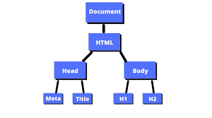

# **Ejercicio Markdown 02 - DOM MD**
*En este texto hablare sobre que es el DOM (Document object model), su funcionamiento y características. Condensando y reforzando la información vista en clase.*

## **Síntesis**
*Un DOM a grandes rasgos provee una visualización estructurada de un archivo HTML, a pesar de que su mayor función sea la visualización de este archivo, el DOM te permite crear, cambiar o remover elementos del documento.*

*Su estructura te permite identificar con mayor facilidad un documento abstracto, que sirve como medio de comunicacion entre el lenguaje de programacion y los contenidos del archivo.* 

*El DOM fue diseñado para ser independiente de cualquier lenguaje de programación, hace que la representación del documento esté disponible desde una simple pero consistente API*

## **Reflexión**
*El DOM es una herramienta para este tipo de documentos (HTML), dándonos facilidades para poder visualizar y editar nuestros archivos, además, gracias a su información visual sobre la estructura y elementos de nuestro archivo, nos hace conscientes de nuestro trabajo.*

## **Conclusión**
*Aprendimos sobre el DOM sus funciones, que es y para que lo podemos usar, además reflexionamos sobre su funcionalidad, y la manera en la que nos puede facilitar nuestro trabajo.*