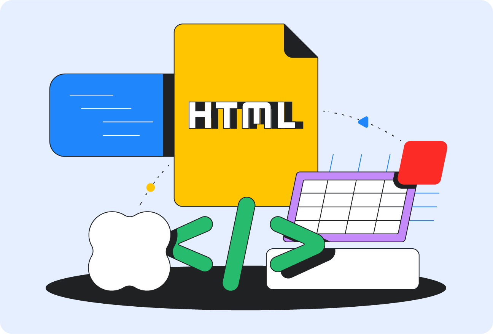

# Ejercicio de Introducción a HTML y el DOM

## Introducción
Para comprender cómo funciona la web moderna, es fundamental entender el lenguaje que la sostiene: **HTML (HyperText Markup Language)**. Este lenguaje de marcado no solo sirve para colocar texto en una pantalla, sino que actúa como el esqueleto semántico de cualquier sitio web. En este texto, exploraremos la relación vital entre el código HTML que escribimos y cómo el navegador lo interpreta para convertirlo en una estructura interactiva y dinámica.

## Síntesis: El Modelo de Objeto del Documento (DOM)
El **Modelo de Objeto del Documento**, mejor conocido como **DOM** (*Document Object Model*), es una interfaz de programación que actúa como una representación lógica del documento HTML. Cuando un navegador carga una página, lee el código fuente y crea este "árbol de nodos". Cada etiqueta, atributo y fragmento de texto se convierte en un objeto que podemos manipular. Esta estructura es lo que permite que una página web deje de ser un documento estático y se convierta en una aplicación dinámica.

A través del DOM, los lenguajes de programación como JavaScript pueden acceder al contenido, cambiar estilos o responder a eventos del usuario en tiempo real. Por ejemplo, al hacer clic en un botón, el navegador no necesita recargar toda la página; simplemente accede al nodo específico en el árbol del DOM y lo modifica. Es, en esencia, el puente que conecta el marcado estructural del HTML con la interactividad de la web moderna.

Sin el DOM, el HTML sería simplemente una hoja de papel digital. Gracias a esta jerarquía de objetos, los desarrolladores pueden construir interfaces complejas donde los elementos aparecen, desaparecen o cambian de forma según la interacción. Entender el DOM es comprender cómo el navegador "piensa" y organiza la información que nosotros estructuramos previamente con etiquetas HTML.

## Reflexión
Personalmente, me parece que el DOM es la parte más fascinante del desarrollo web. Es increíble pensar que algo tan sencillo como una etiqueta `
` se convierte en un objeto con el que podemos interactuar. Me resulta especialmente útil porque nos da el control total sobre la experiencia del usuario, permitiendo crear sitios web que se sienten "vivos" y no solo documentos para leer.

## Conclusión
En conclusión, la combinación de una buena estructura en HTML y el uso inteligente del DOM es lo que define la calidad de un desarrollo web. Mientras que el HTML nos da la base y el orden, el DOM nos entrega la flexibilidad necesaria para innovar. Dominar ambos conceptos es el primer gran paso para cualquier persona que aspire a crear experiencias digitales completas y funcionales.

